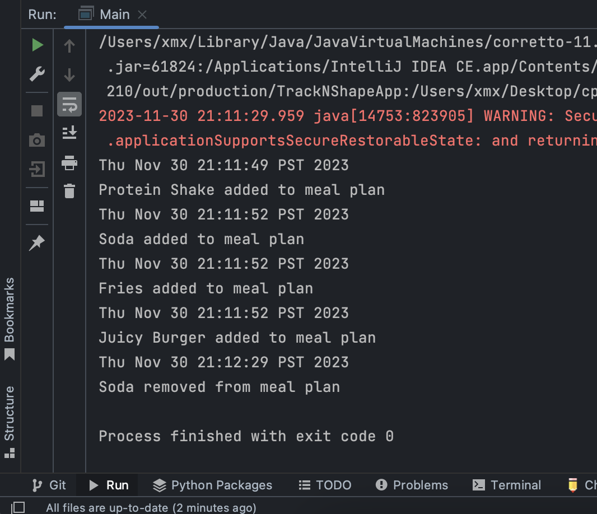
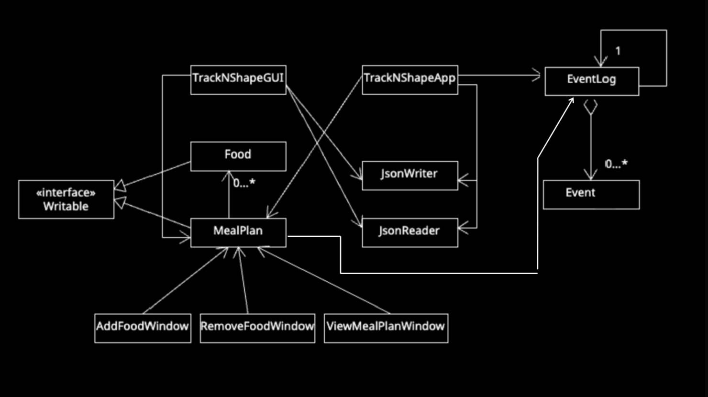

# TrackNShape

## Project Info

**TrackNShape** is your ultimate *nutrition* and *fitness* key. Beyond just regular old simple fitness tracking, it also
functions as your own personalized nutritional guide, simplifying your fitness and health goals with accuracy and ease. 
This application is designed to work with a wide range of individuals, including athletes, weight-loss warriors, and 
individuals looking to live a more health-conscious lifestyle. TrackNShape empowers you to manage your dietary choices, 
monitor food macronutrients, and navigate your nutritional journey towards a dreamy healthy lifestyle.

My enthusiasm for this project comes from my unapologetic mindset to maintaining a healthy lifestyle. I strongly believe
that this project has the ability to assist individuals akin to myself, who place a strong emphasis on their health as a
non-negotiable. It not only promotes awareness about nutrition but also offers the exceptional convenience of planning 
crucial health and fitness data within this user beginner-friendly application.

## User stories

- As a user, I want to be able to add food items to my meal plan.
- As a user, I want to be able to view all the food items in my meal plan.
- As a user, I want to be able to change status (eaten/not eaten) of food items in my meal plan.
- As a user, I want to be able to remove food item(s) from my meal plan.
- As a user, I want to be able to see all the food items that I have eaten and the rest that I haven't eaten.
- As a user, I want to be able to calculate macro-nutritional values of my meal plan.
- As a user, I want to be able to save my meal plan to a file (if I so choose)
- As a user, I want to be able to load my meal plan from a file (if I so choose)

# Instructions for User

- You can generate the first required action related to the user story "adding multiple Xs to a Y" by adding food to 
- a meal plan 

- You can generate the second required action related to the user story "adding multiple Xs to a Y" by removing food
- in the meal plan

- You can locate my visual component in the GUI, there is an image, and also a window when you click add meal plan 
- or view meal plan

- You can save the state of my application by clicking on the save button on the main gui
- You can reload the state of my application by clicking on the load button in the gui

## Phase 4: Task 2

## Phase 4: Task 3 (UML DIAGRAM)

Project Reflection:
If I had more time to work on the project: 
- I would reduce coupling of classes in the ui package
- I would structure JFrame elements better so that not most would have local scope
- I would make an interface for window classes as there is alot of repeated code
